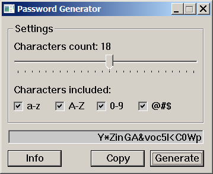

# Password Generator
A pure WinAPI C++ program for generating strong passwords. 

You can download the compiled files `password_generator_x32.exe` and `password_generator_x64.exe` on the [release page](https://github.com/ap13ski/Password-Generator/releases/tag/release). 

Compilers: [MinGW-W64 12.0.0](https://www.mingw-w64.org) (64-bit), [TDM-GCC 9.2.0](https://sourceforge.net/projects/tdm-gcc/) (32-bit).

Tested on MS Windows: XP (32-bit only), 7, 10, 11.

