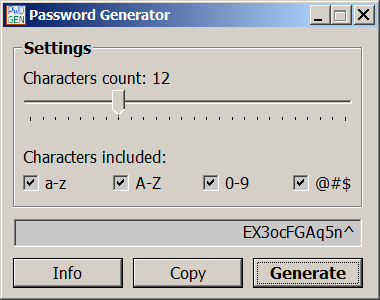

# WinAPI Password Generator
A simple C++ program using pure WinAPI which can generate strong passwords. 

You can download the compiled file `pwd.exe` on the [release page](releases/tag/main). 

Visual C++ 6.0, 32-bit compiler v.12.00.8168.

